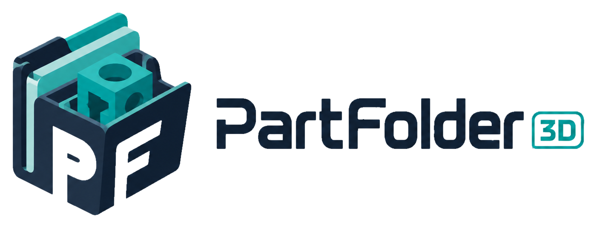

<div align="center">

<picture>
  <source media="(prefers-color-scheme: dark)"  srcset="docs/images/logo-horizontal-dark.png">
  <source media="(prefers-color-scheme: light)" srcset="docs/images/logo-horizontal-light.png">
  
</picture>

### A fast, self-hosted library manager for your 3D-printing & CAD files

</div>

> [!IMPORTANT]
> **Under active development.** PartFolder 3D is usable and published — pull the images and
> follow [Getting started](#getting-started). It's still evolving quickly, so **breaking changes
> can land between releases** (database schema, config, or API): pin a specific version, back up
> your data, and read the release notes before upgrading. Watch/star the repo to follow progress.

<div align="center">


</div>

---

## What's New

### v0.7.1 (2026-07-21)

- **Built-in HTTPS at nginx** — self-hosters without an upstream reverse proxy can now serve HTTPS
  directly. Set `TLS_MODE=selfsigned` for an auto-generated cert (instant HTTPS, browser trust
  warning) or `TLS_MODE=provided` to bring your own real cert; the default `off` is unchanged. See
  [`docs/tls.md`](docs/tls.md), and the new **HTTPS / TLS** card in admin Settings points the way.
- **Security:** nginx base image bumped `1.27-alpine` → `1.30-alpine`, fixing several 2026 nginx
  CVEs (incl. CVE-2026-42533).
- **Upgrading:** the default (plain-HTTP) setup needs **no changes** — TLS is opt-in and defaults
  to `off`, so just `pull` and go. Only if you bind-mount a **custom** `nginx.conf` do you need to
  reconcile it against this release (the config was refactored into includes) — see the CHANGELOG.

### v0.7.0 (2026-07-20)

- **Added: prinnit.com import.** Paste a [prinnit.com](https://prinnit.com) design URL into
  the import wizard and it now pre-fills the real title, description (with an appended
  print-details block — print time, difficulty, weight, bed size, filaments, video), creator,
  tags, and gallery images. prinnit's design pages are a client-rendered app with no metadata
  for the built-in scraper to read, so a dedicated connector pulls the details from its public
  API instead. No setup required. The paid `.3mf` is still downloaded after purchase and
  uploaded in the wizard.

### v0.6.1 (2026-07-19)

- **Fixes a worker crash-loop on large models.** Analyzing a very large mesh could
  out-of-memory–kill the whole background worker and then retry forever, stalling all
  jobs. Mesh analysis now runs in an isolated, memory- and time-bounded subprocess, so one
  bad file can never take the worker down, and a repeatedly-failing job is retried a
  bounded number of times and then marked failed instead of looping.
- **Very large models are skipped gracefully.** Meshes over a configurable size — including
  huge multi-object 3MFs (detected by uncompressed geometry size before loading) — are
  flagged "too large to analyze" and cached, instead of failing on every rescan.
- **No more duplicate analysis.** A model is no longer analyzed twice at once after a
  restart or double-enqueue.

### v0.6.0 (2026-07-19)

**Added: Manyfold import workflow.** Import a model straight from a self-hosted
[Manyfold](https://manyfold.org) instance — register the instance with its OAuth credentials
under **Admin → AI & Scraping → Manyfold**, then paste any model URL from it into the
import wizard. PartFolder pulls the metadata, tags, images, and 3D files straight from Manyfold's
API into the wizard for review (a new **Assets** step lets you deselect any files you don't want
before committing).

For the full, per-release history of every version, see **[CHANGELOG.md](CHANGELOG.md)**.

---

## Overview

**PartFolder 3D** is a self-hosted, Docker-based web application for managing a
personal, household, or team library of 3D-printing and CAD assets — `3MF`, `STL`,
`OBJ`, `Blender`, `Fusion`, `STEP`, and more. It aims to be a **simpler, faster
alternative** to existing tools.

The core idea: a **shared, multi-user catalog** where files live in stable, safe
locations on disk, while discovery happens through a fast, modern web UI driven by a
rich tagging system. Every item carries a **portable YAML sidecar**, so its full
metadata travels with the files — enabling manual re-import, instance-to-instance
transfer, and resilience against database loss.

> [!NOTE]
> The full feature set below is **built and released** (v0.7.1) — see the
> [Roadmap](#roadmap--status) for phase status and [Getting started](#getting-started) to run it.

### Why / design principles

1. **Simple over clever.** Defaults should "just work."
2. **The filesystem is a peer source of truth.** People edit, print, and add files
   outside the app — so the system continuously reconciles **DB ⇄ sidecar ⇄ disk**.
3. **Never destroy or lose data.** Stable storage, no risky auto-moves, sidecars
   everywhere, integrity checks.
4. **Optional everything (except the basics).** AI, scraping, backups, extra
   libraries — all optional and skippable.
5. **Fast and crisp.** Modern UI, instant search, responsive grid/table views.

---

## Features

> Built and working in the current release.

### 📚 Catalog, search & browse
- Shared multi-user catalog — everyone sees the same items, files, and images.
- Full-text search across **tags, titles, and descriptions** (PostgreSQL FTS).
- **Table** and **grid** catalog views; per-user **favorites** (star / filter / sort).
- Item page: image carousel + default-image picker, full metadata, source link,
  license, full directory path with a configurable **path-prefix rewrite** and copy
  button to jump to the source folder on your machine.
- **Per-library × per-OS local path prefixes** — each library carries independent
  Windows `\` and Linux/macOS `/` prefixes; the browser auto-detects your OS and picks
  the right one (overridable in Settings).
- Theme: dark / light / **system default**, with a persisted per-user override.

### 🏷️ Tagging
- **Flat canonical tags** with popularity counts.
- Optional **categories / namespaces** (e.g. `type:keychain`, `feature:mmu`).
- **Aliases / synonyms** to fold source-site and AI tags onto canonical tags.
- **New-tag approval queue** keeps the vocabulary clean.
- **Virtual tag-browse tree** derived from the most-used tags, N levels deep
  (default 4) — purely a DB/UI construct; tags never move files on disk.
- **Tag delete** — removes a tag from all items that use it (items are never deleted);
  safe to run on active or pending tags.
- **Typeahead autocomplete** in the import-wizard Tags step — prefix search on existing
  tags with keyboard navigation.
- **Starter-tags loader** — seeds a curated 57-tag vocabulary (7 categories: type,
  function, feature, theme, process, audience, mechanical) from the Tags page
  (Content section).
- Tag-cloud **Alpha / Number sort** toggle; **in-use-only** filter hides zero-item tags.
- Admin Tags table (`/admin/content/tags`) sortable by **Category** and **Uses**.

### 📥 Import & inbox
- **Inbox folder drop** — drop model files + a URL/link + an optional sidecar; a
  watcher detects it and queues an import wizard.
- **"Add Asset" web wizard** — drag-drop upload with source URL, tags, description.
- **Source-URL-only** import — fetch public metadata/images where permitted.
- **Manyfold import** — connect self-hosted [Manyfold](https://manyfold.org) instances
  with OAuth credentials, then import a model straight from its URL: metadata, tags,
  images, and 3D files are pulled via Manyfold's API into the wizard for review.
- **Prinnit import** — paste a [prinnit.com](https://prinnit.com) design URL and the
  wizard pre-fills title, description (with print time / difficulty / weight / filaments),
  creator, tags, and gallery images via prinnit's public API. No setup — the site's
  static scraper sees only an empty SPA shell, so a dedicated connector reads the real
  metadata. You download the paid `.3mf` after purchase and upload it in the wizard.
- **Import from another instance's share link** — pull assets + metadata and
  reconcile against your library and canonical tags.
- Wizard suggests an **editable title** before commit (becomes the on-disk name and
  slug), loads sidecars, scrapes permitted sources, and enforces required tags.

### 🖼️ Rendering & thumbnails
- Headless **CPU** mesh rendering to PNG for **STL / 3MF / OBJ / PLY** at v1.
- Blender / Fusion / STEP / CAD: generic icon + any scraped/manual image (optional
  add-on renderer containers later).
- Renders cached per file hash; re-rendered automatically when a file changes.
- Renders run in an **isolated subprocess** with a wall-clock kill timeout
  (`RENDER_TIMEOUT_S`, default 300 s) and a CPU-thread cap (`RENDER_CPU_THREADS`,
  default 2) so the worker is never blocked by a runaway mesh.
- **Render mode** — configure when thumbnails auto-render via Settings → Instance
  settings (admin) or the `RENDER_MODE` env var: *Render all models* / *Render only
  when a model has no images* / *Disable rendering*; the DB setting overrides the env.
- Orphaned "running" render jobs are **auto-recovered** on worker restart — marked
  failed and re-queued so no render silently disappears.
- Renders are **surfaced as gallery images** in the item carousel alongside scraped and
  uploaded images.
- **Per-item image upload and delete** — add or remove curated images at any time;
  stored in `images/` next to the model files.
- **Delete to trash** — moves an item directory to a recoverable trash folder inside
  `DATA_DIR` rather than permanently removing it.

### 📐 Asset analysis
- **Estimated filament use** — per-object grams and color count for STL and 3MF files,
  computed from mesh volume (filament density and infill % are configurable site-wide
  settings).
- Non-watertight meshes are flagged with a **low-confidence** badge on the item page.

### 🔄 Reconciliation / scan engine
- Bidirectional **sidecar ⇄ DB sync**; conflicts raised as Issues.
- Detect **new / removed / extra** files; re-render on file change.
- **Orphans, dead links & integrity** checks (hash verification).
- Per-behavior **Auto** vs. **Review** modes, a **Change Log**, an **Issues** page,
  and a live **job/queue monitor**.
- **Atomic, all-or-nothing** directory operations with crash-safe rollback.
- Per-item **"Rescan disk"** button for on-demand reconciliation.
- **Per-type issue resolution** — the Issues page (`/admin/activity/issues`) offers
  actionable, context-aware choices instead of a blanket "mark resolved": orphan →
  Import wizard (prefilled from sidecar) / Delete (→ trash) / Ignore; conflict → keep
  DB / keep sidecar; dead link → clear source URL; corruption → accept new hash;
  missing file → remove record; sidecar error → retry. Resolved and ignored issues are
  **deduplicated** — the scan never re-creates the same issue.
- **Modification tracking** — detects when local model files have been changed from the
  originally downloaded versions; items show a "modified copy" notice on public share
  pages when flagged.

### 🖨️ Print history
- Per-item print records (all fields optional): note + **private/public** visibility,
  date, and logging user.
- Attach **gcode / 3mf-project** and **finished-print photos**.
- Optional **structured settings** (printer, filament, nozzle, layer height, rating).
- **Best-effort gcode parsing** for filament required + estimated print time.
- Aggregate **print stats** (totals, success rate, filament used, most-printed).

### 🔗 Sharing
- Per-design **tokenized share links** — public, read-only, optionally downloadable.
- **Full-site share link** (admin) for temporary account-less browse/download.
- Configurable default expiry, per-link override, and revocation.
- Links are **machine-ingestible** by other PartFolder 3D instances.
- **Share audit** — creation, expiry, revocation, and view/download access events.

### 🤖 AI (optional)
- Providers you supply keys for: **Anthropic Claude**, **OpenAI**, **local LLM
  (Ollama / OpenAI-compatible)**.
- Tag suggestion/matching, description cleanup, web-scrape summarization.
- Prefers existing canonical tags; routes a few genuinely new tags to the queue.
- **Manual-only always works** with zero AI configured.
- Optional **AgentQL fallback scraper** — for Cloudflare-gated sites (e.g. MakerWorld)
  that block the built-in static scraper; BYO API key with configurable free-allowance
  and monthly $ cap (AI & Scraping section).
- **AI usage tracking** — per-provider call log with input/output token counts and
  estimated cost per 24 h / 7 d / 30 d window (AI & Scraping section).

### 🛠️ Admin & multi-user
- First-run wizard creates the admin; **no open registration** — users join via a
  **tokenized invite link** (7-day expiry, revocable, with invite history).
- Email is **required** and is the login identity. Auth layer designed to accept
  **SSO (OIDC/SAML)** later without a rewrite.
- Admin **password-reset** links; user management (create/disable, roles).
- **Scheduled backup of DB + config** (library files are *not* backed up by design).
- Full-catalog **JSON export**; library, tag, and site-capability administration.
- **Scheduled-jobs** view (last run / next run / running now) + manual triggers.
- **Job lifecycle controls** — the job monitor (`/admin/activity/jobs`) supports: cancel
  + restart of running jobs; retry of failed jobs (the retry supersedes the original
  once it succeeds); a context-sensitive **Clear…** button that archives rows by the
  active status filter; and an **archive view** for historical records.
- **Job retention** — succeeded rows are pruned after 7 days, failed/cancelled/superseded
  after 30 days; configurable via `JOB_RETENTION_SUCCEEDED_DAYS` /
  `JOB_RETENTION_FAILED_DAYS`.
- **Aurora UI** — switchable **top-bar or side navigation** (per-user preference in
  Settings); **customizable widget dashboard** on the home page (stat tiles link to
  their detail pages); **Quick Start** onboarding page.
- **5-section admin nav** — Content · Users & Access · AI & Scraping · Jobs & Activity ·
  Data & Backups — consolidates 17+ old entries into a tabbed layout; old `/admin/*`
  paths redirect automatically to their new locations.
- **Import management** — delete an in-progress import session, remove a staged image,
  or clear an inbox folder from the Imports page.

### 🔌 API
- **Full REST API** covering everything the UI can do.
- Auth via **per-user API keys**; **OpenAPI/Swagger** docs auto-generated by FastAPI.

### 🔐 Security
- All secrets (user API keys, site tokens, AI keys, invite/reset tokens) are
  **encrypted at rest** with an instance key — the DB never stores readable secrets.

---

## Architecture

### Container layout

`docker-compose.yml` is the **production** file (pulls published images; edit library mounts + `.env`).
`docker-compose.dev.yml` is the **dev** file (builds all images locally; hot reload).

```
                       ┌─────────────────────────────────────────┐
        :8973  ───────▶│  nginx   (single entry point / proxy)   │
                       │   • serves built frontend               │
                       │   • proxies /api → backend              │
                       │   • streams file downloads              │
                       └───────────────┬─────────────────────────┘
                                       │
                       ┌───────────────▼──────────┐   ┌──────────────────┐
                       │  backend  (FastAPI REST) │   │  frontend (build │
                       │  auth · API · OpenAPI    │   │  artifact: React)│
                       └───────┬───────────┬──────┘   └──────────────────┘
                               │           │
                  ┌────────────▼──┐   ┌────▼───────────────────────────┐
                  │  db (Postgres)│   │  redis (job queue / scheduler) │
                  │ catalog·users │   └────┬───────────────────────────┘
                  │ tags·history  │        │
                  └───────────────┘   ┌────▼─────────────────────────────┐
                                      │ worker  scans · imports · renders │
                                      │ AI tagging · scraping · backups   │
                                      └───────────────────────────────────┘
```

| Container  | Role |
|------------|------|
| `nginx`    | Single external entry point / reverse proxy; serves the built UI **read-only from the shared `frontend_dist` volume**, proxies `/api`, streams downloads. |
| `frontend` | **One-time-run** container (`restart: "no"`) — copies the built React/TypeScript/Vite UI into the shared `frontend_dist` volume, then **exits 0** (expected). nginx waits for it, then serves those files. |
| `backend`  | FastAPI app — REST API, auth, OpenAPI docs. |
| `worker`   | Background jobs — scans, imports, thumbnail rendering, AI tagging, scraping, backups, sync. |
| `redis`    | Job queue + scheduling broker. |
| `db`       | PostgreSQL — catalog, users, tags, history, jobs, capabilities. |

Default external port: **`8973`** (nginx), changeable in `docker-compose.yml`.

### Storage model

Files are **never organized by tags on disk** — tags live in the DB and drive a
*virtual* browse tree, so re-tagging never moves bytes.

```
./data/        -> /data          # app-owned: DB data, config, backups, inbox, thumbnail cache, logs
./<library>/   -> /<libraryname> # one or more library mounts (local disk or NAS)
```

Each item lives in a **stable, sharded directory** keyed by a short hash:

```
/<library>/<shard>/<itemname>-<key>/
    <itemname>-<key>.yml     # sidecar — canonical, portable, full metadata mirror
    model files (stl / 3mf / obj / blend / f3d / step / …)
    project.zip              # optional
    images/                  # scraped + uploaded images
    renders/                 # generated PNG thumbnails
    prints/                  # gcode / 3mf-project, print photos
    source.url               # optional link file
```

- `<shard>` — a key-prefix shard (e.g. `ab/`) that scales to 100k+ items.
- `<key>` — a 6–8 char base32 hash, the item's **stable, unique identity**. The
  `itemname-<key>` directory and matching URL slug share it, so duplicate titles
  never collide.
- The layout is **stable**: the only operation that ever moves files is a **title
  rename** (atomic, all-or-nothing). Because everything resolves by the invariant
  `<key>`, **share links, downloads, and API references survive a rename.**

### YAML sidecars

Every item carries a `<itemname>-<key>.yml` sidecar — a portable, full mirror of its
metadata that lives next to the files. Sidecars make items self-describing, support
manual re-import and instance-to-instance transfer, and let the catalog be rebuilt
even after database loss. The reconciliation engine keeps **DB ⇄ sidecar ⇄ disk** in
sync, raising an Issue when they genuinely conflict.

---

## Tech stack

| Layer        | Technology |
|--------------|------------|
| Frontend     | React · TypeScript · Vite · Tailwind CSS · shadcn/ui |
| Backend      | Python · FastAPI · OpenAPI/Swagger |
| Database     | PostgreSQL (full-text search) |
| Jobs / queue | Redis + worker (arq / RQ) |
| Reverse proxy| nginx |
| Rendering    | trimesh + pyrender / VTK (CPU-only, v1) |
| Packaging    | Docker + docker-compose |
| AI (optional)| Anthropic Claude · OpenAI · Ollama / OpenAI-compatible |

---

## Roadmap / status

Honest snapshot — this project is in **active development** (v0.7.1).

- [x] Product Requirements Document drafted (`PRD.md`, 18 sections)
- [x] Brand assets — logo, icons, favicons, colors (`docs/images/`)
- [x] Repository scaffolding (docker-compose, services, CI)
- [x] Data model + database migrations (10 migration files)
- [x] Authentication, invites, password reset, API keys
- [x] Storage layout, sidecar read/write, sharding
- [x] Reconciliation / scan engine (Auto vs. Review, Issues, Change Log)
- [x] Import wizard + inbox watcher
- [x] Mesh rendering / thumbnail pipeline (STL / 3MF / OBJ / PLY)
- [x] Catalog UI — full-text search, tag cloud, table/grid views, favorites
- [x] Print history + gcode parsing + stats
- [x] Sharing (per-item & full-site links) + share audit
- [x] AI-assisted tagging (Claude / OpenAI / Ollama — optional)
- [x] Admin tools — backups, JSON export, tag admin, scheduled jobs
- [x] Full REST API + OpenAPI docs
- [x] First-run setup wizard
- [x] First tagged release + published Docker images (v0.1.0 / v0.1.1)
- [ ] Load testing at 100k-item scale
- [ ] SSO (OIDC/SAML), email delivery, OctoPrint integration (out-of-scope / future)

See the [CHANGELOG](CHANGELOG.md) for the full delivered feature list.

---

## Getting started

### Production install (published images)

Images are published to GitHub Container Registry on every release and available now.

```bash
# 1. Get the files (clone or download docker-compose.yml + .env.example)
git clone https://github.com/crzykidd/partfolder3d.git
cd partfolder3d

# 2. Create your .env — set a strong password and your desired port
cp .env.example .env
#    edit .env: set POSTGRES_PASSWORD (required) and APP_PORT (default 8973)

# 3. Mount your library directory in docker-compose.yml
#    In both the `backend` and `worker` sections, uncomment and edit:
#      - /mnt/nas/3dprints:/library/main   # host path → container path

# 4. Start the stack
docker compose up -d

# 5. Open the app and complete the first-run wizard
#    http://localhost:8973
```

> **Database & Redis passwords (required in production).** Set `POSTGRES_PASSWORD` (and
> `REDIS_PASSWORD`) in `.env`. The backend **and** worker refuse to start if the DB password is
> left as the shipped default `changeme` — you'll see a startup error `DATABASE_URL is using the
> insecure default password 'changeme'`. This is a *"don't ship the default"* guard, **not** a
> strength check: any value other than `changeme` is accepted (`somepassw0rd` is fine), so choose
> one appropriate for your environment. One caveat — the password is interpolated into a
> connection URL, so **avoid URL-reserved characters** (`@ : / # ? %`); stick to letters, digits,
> and `- _ .`, or URL-encode it. The **dev** stack (`docker-compose.dev.yml`) sets `DEBUG=true`,
> so it runs with `changeme` out of the box for local development.

What happens on first `docker compose up -d`:

- Images are pulled from `ghcr.io/crzykidd/partfolder3d(-frontend|-nginx):latest`.
  To pin a specific release, edit the image tags in `docker-compose.yml` (e.g. `:0.1.1`).
- **Migrations run automatically** — the backend entrypoint runs `alembic upgrade head`
  before uvicorn starts (`RUN_MIGRATIONS=true`); the worker waits for the backend to be
  healthy. No manual migration step, no extra container.
- **Data lives in named volumes** (`db_data`, `redis_data`) and the `./data/` bind-mount
  for thumbnails, backups, and config. Library files stay on your host wherever you mount them.
- **nginx config is baked into the `partfolder3d-nginx` image** — the reverse proxy config
  (`client_max_body_size 1024m`, `/api/` proxy, SPA fallback, `/img/` logos) ships inside
  the image so no host config files are needed. The baked default is the supported path.
  The same image also supports optional built-in TLS termination via `TLS_MODE` — see
  [`docs/tls.md`](docs/tls.md).
- **The `frontend` container runs once and exits — this is normal.** It copies the built UI
  into the shared `frontend_dist` volume and exits `0` (`restart: "no"`); nginx waits for it
  (`depends_on: service_completed_successfully`), then serves those files. A `frontend`
  showing `Exited (0)` in `docker compose ps` is expected, not a failure.

> [!IMPORTANT]
> **`frontend` + `nginx` share the `frontend_dist` volume, and it must be writable by your
> `PUID`/`PGID`.** The `frontend` container **writes** the built UI into `frontend_dist` as
> your configured `PUID:PGID`; `nginx` then **serves it read-only** from the same volume. Run
> the app services (`backend`, `worker`, `frontend`) with the **same `PUID`/`PGID`** so
> ownership of that shared volume stays consistent. On a fresh install this just works. If you
> **reuse an old volume or change `PUID`/`PGID`**, the frontend can fail to write it and exit
> with `FATAL: '/dist' … is not writable by uid=… gid=…` (which blocks nginx). Fix it by
> recreating the volumes — `docker compose down -v` (⚠️ also wipes db/redis/`./data`) — or
> `chown` the `frontend_dist` volume to your `PUID:PGID`.

> [!TIP]
> **Built-in HTTPS** — `TLS_MODE` in `.env` picks the mode: `off` (default, plain `:80`,
> unchanged) / `selfsigned` (nginx auto-generates a cert, HTTPS immediately, browser trust
> warning) / `provided` (bring your own real cert). No upstream reverse proxy? Set
> `TLS_MODE=selfsigned` or `provided` to serve HTTPS directly from nginx — see
> [`docs/tls.md`](docs/tls.md).
>
> **Custom nginx config** — if you need to change upload limits or tune proxy timeouts,
> uncomment the bind-mount line in the `nginx:` section of `docker-compose.yml` and
> supply your own `./nginx/nginx.conf`. Watch release notes for **"⚠️ nginx config
> changed"** callouts before upgrading — the callout means the baked default changed
> and you should reconcile your custom copy.

**First-run wizard** — open **http://localhost:8973** and follow the prompts:

1. Create the admin account and fill in instance basics (name, external URL, time zone).
2. Add your first library: go to **Admin → Content → Libraries**, click **Add library**,
   give it a name, and enter the container path you mounted (e.g. `/library/main`).
3. *(Optional)* Click the trigger to run an initial scan — it finds everything already
   in the library and builds your catalog.

> [!TIP]
> **Quick Start guide** — after completing the first-run wizard, visit
> **[http://localhost:8973/quick-start](http://localhost:8973/quick-start)** for a
> guided walkthrough: add a library, load Starter Tags, enable AI tagging, and schedule
> backups — all from one page.

The default external port is **`8973`**, changeable via `APP_PORT` in `.env`.

---

<details>
<summary><strong>Build from source (dev stack — for contributors)</strong></summary>

The self-contained `docker-compose.dev.yml` builds all images locally and gives you hot
reload for both the backend (uvicorn `--reload`) and frontend (Vite HMR).

```bash
git clone https://github.com/crzykidd/partfolder3d.git
cd partfolder3d
cp .env.example .env
docker compose -f docker-compose.dev.yml up -d --build
```

The dev stack bind-mounts all storage under `./private_data/data/` (Postgres, Redis, app
data, and a sample library at `/library`) so you can inspect every file on the host.
Migrations run automatically on startup via the same `RUN_MIGRATIONS=true` mechanism.

Then open **http://localhost:8973** and complete the first-run wizard as above.
After setup, visit **http://localhost:8973/quick-start** for the in-app Quick Start guide.

</details>

---

## Upgrading

This project is in active development — **breaking changes can land between releases** (schema, config,
or API), so upgrade deliberately:

1. **Pin a specific version.** Set explicit image tags in `docker-compose.yml` (e.g.
   `:0.6.1` instead of `:latest`) so a `pull` never surprises you.
2. **Read the release notes first.** Check the [CHANGELOG](CHANGELOG.md) / the GitHub
   release for the version you're moving to — watch for **⚠️ nginx config changed** and
   other migration callouts.
3. **Back up.** Run a backup from **Admin → Data & Backups** (DB + `secret.key`) and
   snapshot your library mount. See [`docs/backup-restore.md`](docs/backup-restore.md).
4. **Bump the pins and pull:**

   ```bash
   # edit docker-compose.yml image tags to the new version, then:
   docker compose pull
   docker compose up -d
   ```

   Migrations run automatically on startup (the backend entrypoint runs
   `alembic upgrade head` before serving). Watch `docker compose logs -f backend` for the
   startup banner and migration output.

> **Job-queue format changes — drain the worker queue.** Some releases change the internal
> format arq uses to serialize background jobs (e.g. the **pickle → JSON** switch). When a
> release note flags this, make sure the worker queue is **empty before you upgrade**: stop
> kicking off new work and let the worker finish, or upgrade during an idle window (jobs are
> short-lived and the queue is normally empty). Any job still sitting in Redis in the old format
> won't deserialize on the new worker — this is **not data loss** (re-scan the item or re-run the
> action to re-trigger it), but draining first avoids startup error noise. If you want to be
> certain the queue is clear, stop the worker, then
> `docker compose exec redis redis-cli -a "$REDIS_PASSWORD" FLUSHDB` before starting the new
> version (this only clears the transient job queue, not your data).

---

## Contributing

Early days! 🌱 Ideas, questions, and use-case feedback are **very welcome** — please
open an issue or start a discussion. The full stack is built and released, but the
project is still moving fast on a single-maintainer roadmap, so we're **not accepting
external code PRs yet** — the architecture and priorities are still settling. That will
open up as things stabilise; watch or star the repo to follow progress.

---

## License

Licensed under the **GNU Affero General Public License v3.0** (AGPL-3.0) — see
[`LICENSE`](LICENSE). In short: you're free to use, modify, and self-host PartFolder 3D,
but if you run a modified version as a network service, you must make your source
available under the same license.

© 2026 crzykidd

---

## Acknowledgements & brand

Logos, icons, and favicons live in [`docs/images/`](docs/images/) (see that folder's
[README](docs/images/README.md) for usage, the auto dark/light `<picture>` snippet,
and app `<head>` / `manifest.json` references).

**Brand colors**

| Token | Hex | Use |
|-------|-----|-----|
| Teal (primary) | `#0FA4AB` | accent, calibration cube, "3D" badge |
| Navy (ink) | `#091D35` | flat icon body, light-mode wordmark, tiles |

<div align="center">

<sub>PartFolder 3D — v0.7.1 · built by <code>crzykidd</code></sub>

</div>
